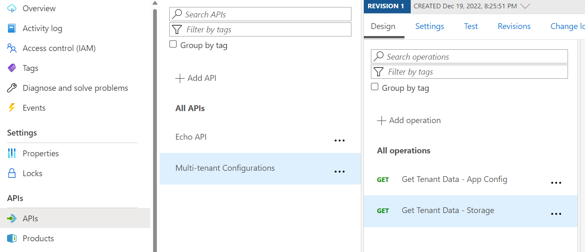

# Azure API Management - Multi-tenant Solution

This tutorial will illustrate the use of APIM in multi-tenant scenarios. In multi-tenant solutions, there is a need to [map requests to tenants](https://learn.microsoft.com/en-us/azure/architecture/guide/multitenant/considerations/map-requests). Other examples are having to pick the appropriate backend API based on the tenant customer id, or to validate the client request based on client certificate in mTLS authentication setup.

## Concepts 

The following general concepts will be demonstrated:
1. Use of [managed identities to authenticate API Management](https://learn.microsoft.com/en-us/azure/api-management/api-management-authentication-policies#ManagedIdentity) to other Azure Services (Azure Storage Table and App Configuration).
1. Use of [send-request APIM policy](https://learn.microsoft.com/en-us/azure/api-management/api-management-advanced-policies#SendRequest).
1. Use of [internal cache with APIM](https://learn.microsoft.com/en-us/azure/api-management/api-management-howto-cache) and [caching policies](https://learn.microsoft.com/en-us/azure/api-management/api-management-caching-policies).

The components used to illustrate this solution are:
1. [Azure API Management](https://learn.microsoft.com/en-us/azure/api-management/api-management-key-concepts)
1. [App Configuration](https://learn.microsoft.com/en-us/azure/azure-app-configuration/overview)
1. [Azure Storage Account (Table)](https://learn.microsoft.com/en-us/azure/storage/tables/table-storage-overview)
1. [Azure Cache for Redis](https://learn.microsoft.com/en-us/azure/azure-cache-for-redis/cache-overview) external cache option.

## Architecture


In the above diagram the request flow is as follows:
1. A request from a specific tenant (Tenant 1) is received by APIM
1. The APIM policies are configured to do the following:
    1. Check the internal or external ([Cache for Redis](https://learn.microsoft.com/en-us/azure/azure-cache-for-redis/cache-overview)) cache for tenant data.
    1. If there is a cache miss, go to table storage or app configuration and get tenant data.
    1. Cache the tenant data for subsequent requests.
    1. Process the request, for example, a tenant specific backend API can be used to forward the request. Or to validate the client request using [validate-client-certificate policy](https://learn.microsoft.com/en-us/azure/api-management/api-management-access-restriction-policies#validate-client-certificate) and validate the client certificate.
1. For this illustration we will simply display the tenant data.

This concept can be expanded to connect with other configuration sources such as:
1. [Azure Key Vault](https://learn.microsoft.com/en-us/azure/key-vault/general/overview) Service.
1. Other Azure Managed storage options, Cosmos DB, SQL Database etc.

## Policies Definition

Below are the policies definition that accomplishes the desired outcome using internal cache. Follow steps in the [use an external cache](https://learn.microsoft.com/en-us/azure/api-management/api-management-howto-cache-external) guide to setup an external cache with API Management.  
>**Note**: The Time-to-live for cached entries is set to 120 seconds for this demo. This can be changed based on your scenario.

### Policies Definition for using App Configuration

```xml
<policies>
    <inbound>
        <base />
        <!-- Get the query parameters and create variable context -->
        <set-variable name="tenantid" value="@(context.Request.Url.Query.GetValueOrDefault("uid", ""))" />
        <set-variable name="appConfigUrl" value="@(context.Request.Url.Query.GetValueOrDefault("appconfigurl", ""))" />

        <!-- Look up internal cache for this tenant id (customer) -->
        <cache-lookup-value key="@("tenantdata-ac-" + context.Variables["tenantid"])" variable-name="tenantdata" />

        <!-- If the tenantdata context variable does not exist, make an HTTP request to retrieve it from App Configuration.  -->
        <choose>
            <when condition="@(!context.Variables.ContainsKey("tenantdata"))">
                
                <!-- Send request to App Configuration -->
                <send-request mode="new" response-variable-name="tenantdataresponse" timeout="20" ignore-error="false">
                    <set-url>@{
                            return String.Format("{0}/kv/{1}?api-version=1.0", context.Variables["appConfigUrl"], context.Variables["tenantid"]);
                        }</set-url>
                    <set-method>GET</set-method>
                    <authentication-managed-identity resource="https://azconfig.io" />
                </send-request>

                <set-variable name="tenantdata" value="@(((IResponse)context.Variables["tenantdataresponse"]).Body.As<JObject>())" />

                <!-- Store the response data to internal cache. Cache TTL = 120 seconds. Only cache Ok 200 responses -->
                <cache-store-value key="@("tenantdata-ac-" + context.Variables["tenantid"])" value="@((JObject)context.Variables["tenantdata"])" duration="120" />
            </when>
        </choose>
        <!--
            Continue with request, for example:
                Add validate-client-certificate policy and use the thumbprint for validation.
                If certificate is valid, then use the backend url to send request to appropriate backend for this tenant.
            
            For this tutorial purposes, we are just displaying the tenant data in the response.
        -->
        <return-response>
            <set-status code="200" />
            <set-body template="none">@(((JObject)context.Variables["tenantdata"])["value"].ToString())</set-body>
        </return-response>
    </inbound>
    <backend>
        <base />
    </backend>
    <outbound>
        <base />
    </outbound>
    <on-error>
        <base />
    </on-error>
</policies>
```

### Policies Definition for using Storage Account

```xml
<policies>
    <inbound>
        <base />
        <!-- Get the query parameters and create variable context -->
        <set-variable name="tenantid" value="@(context.Request.Url.Query.GetValueOrDefault("uid", ""))" />
        <set-variable name="storageTableUrl" value="@(context.Request.Url.Query.GetValueOrDefault("storagetableurl", ""))" />

        <!-- Look up internal cache for this tenant id (customer) -->
        <cache-lookup-value key="@("tenantdata-st-" + context.Variables["tenantid"])" variable-name="tenantdata" />

        <!-- If the tenantdata context variable doesn’t exist, make an HTTP request to retrieve it from Table Storage.  -->
        <choose>
            <when condition="@(!context.Variables.ContainsKey("tenantdata"))">

                <!-- Send request to the Table Storage -->
                <send-request mode="new" response-variable-name="tenantdataresponse" timeout="20" ignore-error="false">
                    <set-url>@{
                            return String.Format("{0}(PartitionKey='1',RowKey='{1}')", context.Variables["storageTableUrl"], context.Variables["tenantid"]);
                        }</set-url>
                    <set-method>GET</set-method>
                    <set-header name="x-ms-date" exists-action="override">
                        <value>@(TimeZoneInfo.ConvertTimeToUtc(DateTime.Now).ToString("R"))</value>
                    </set-header>
                    <set-header name="x-ms-version" exists-action="override">
                        <value>2020-04-08</value>
                    </set-header>
                    <set-header name="Accept" exists-action="override">
                        <value>application/json;odata=nometadata</value>
                    </set-header>
                    <authentication-managed-identity resource="https://storage.azure.com" />
                </send-request>

                <set-variable name="tenantdata" value="@(((IResponse)context.Variables["tenantdataresponse"]).Body.As<JObject>())" />

                <!-- Store the response data to internal cache. Cache TTL = 120 seconds. Only cache Ok 200 responses -->
                <cache-store-value key="@("tenantdata-st-" + context.Variables["tenantid"])" value="@((JObject)context.Variables["tenantdata"])" duration="120" />

            </when>
        </choose>
        <!--
            Continue with request, for example:
                Add validate-client-certificate policy and use the thumbprint for validation.
                If certificate is valid, then use the backend url to send request to appropriate backend for this tenant.
            
            For this tutorial purposes, we are just displaying the tenant data in the response.
        -->
        <return-response>
            <set-status code="200" />
            <set-body template="none">@(((JObject)context.Variables["tenantdata"]).ToString())</set-body>
        </return-response>
    </inbound>
    <backend>
        <base />
    </backend>
    <outbound>
        <base />
    </outbound>
    <on-error>
        <base />
    </on-error>
</policies>

```

## Demo Deployment

### Infrastructure Setup

Login to your Azure in your terminal.

```bash
az login
```

To check your subscription.

```bash
az account show
```

Run the deployment. The deployment will create the resource group "rg-\<Name suffix for resources\>". Make sure you are in the 'apim-multitenant' directory.

```bash
git clone https://github.com/fsaleemm/apim-multitenant.git

cd apim-multitenant

az deployment sub create --name "<unique deployment name>" --location "<Your Chosen Location>" --template-file infra/main.bicep --parameters name="<Name suffix for resources>" publisherEmail="<Publisher Email for APIM>" publisherName="<Publisher Name for APIM>" 
```

The following deployments will run:


>**NOTE**: The APIM deployment can take over an hour to complete.

The deployment performs the following steps:
1. Provisions API Management service.
1. Provisions the Storage Account service.
1. Provisions the App Configuration service.
1. Creates a Table called TenantMapping in the Table Storage service.
1. Creates the tenant sample data in App Configuration service.
1. Creates the "Multi-tenant Configurations" API, the "Get Tenant Data - Storage" and "Get Tenant Data - App Config" API operations, and deploys the above policies.
1. Assigns the Storage Table Data Reader role on the Storage Account service to the APIM Managed Identity.
1. Assigns the App Configuration Data Reader role on the App Configuration service to the APIM Managed Identity.

### Add Demo Data (Only for Storage example)

1. Add Tenant data to the TenantMapping storage table in Azure Portal using the Storage browser in the Storage Account created. Click Add entity. 
    
    

1. Add Tenant data, see below for an example based on scenario discussed above. Add a couple of tenant data entities.
    >**Note**: Keep the PartitionKey = 1 for all entities for this demo to work.

    

    Sample Tenant data:
    

## Demo

You can use either the "Get Tenant Data - Storage" or "Get Tenant Data - App Config" API operation to demonstrate the capability. Below are steps for using Storage Account.

1. Go to the demo APIM instance in Azure Portal, go to APIs, and find "Multi-tenant Configurations" API under All APIs that get deployed. Select the "Get Tenant Data - Storage" or "Get Tenant Data - App Config" Operation. Click Test.
    
    

1. In the API test interface, enter the following parameters and click Send:
    
    1. uid=tenantid1 
    
    1. If using Storage Operation, then storagetableurl=https://\<YOUR STORAGE ACCOUNT NAME\>.table.core.windows.net/TenantMapping

    1. If using App Config Operation, then appconfigurl=https://\<YOUR APP CONFIGURATION NAME\>.azconfig.io

    The Tenant 1 data should be in the response:

    

1. Try with uid=tenantid2, the response should be Tenant 2 data.

    

1. Use tracing to see the impact of APIM internal cache. Click Trace. (If you get a message to Enable tracing, then enable it). Click on Trace tab and see the response time:

    

    Look at the trace and you will see the response time is higher because of a cache miss:

    

1. Click Trace again and inspect the trace.

    Compare the response time to previous request.

    

    Look at the trace and you will see the cache hit:

    

>**Note**: The demo uses the developer tier of API Management and thus the absolute response times are not relevant, however, the relative difference in response times when using cache Vs no cache is important to note.

## Disclaimer

The code and deployment biceps are for demonstration purposes only.


